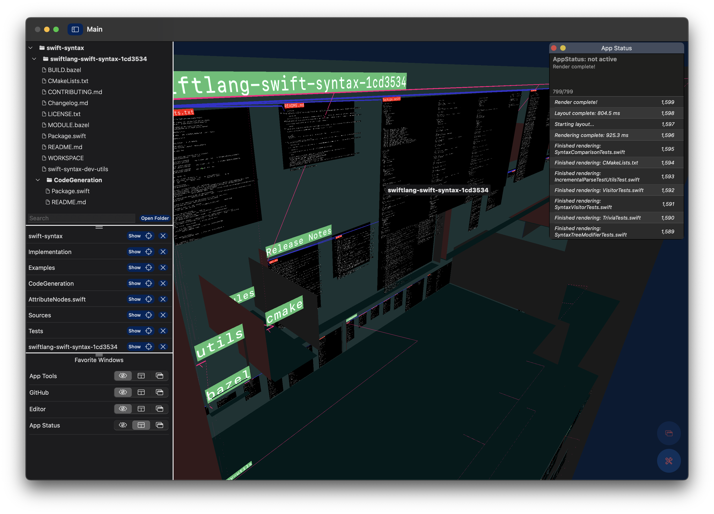
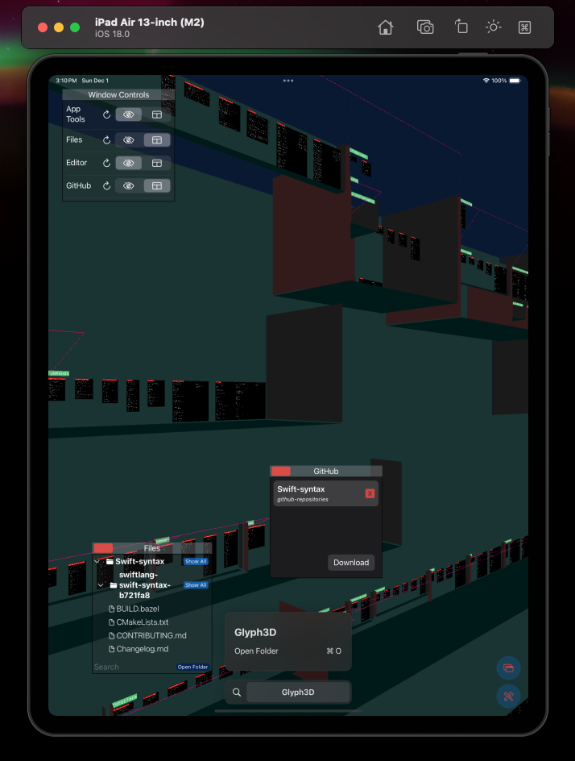
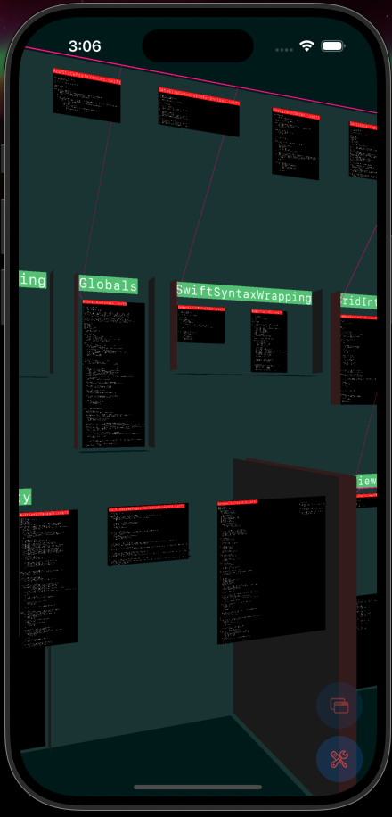

# Glyph3D

<table>

<tr>
<td>

</td>
  
<td>

</td>

<td>

</td>
</tr>

</table>

Download in TestFlight for macOS:

https://testflight.apple.com/join/Q77FGU62

Download in TestFlight for iOS / iPad OS:

https://testflight.apple.com/join/8bWcqyGz

## Open Beta

'Glyph3D' is the new application bundle that supports macOS and iOS / iPadOS compatible devices.

## How to run it

- Download from TestFlight above

OR

- Clone this repository
- Open the `xcproject`
- (As needed) update the signing settings within Xcode
- Select the mobile or desktop variant and accompanying device, and then run.  

### Contributions

These are the core libraries in this bundle:

https://www.github.com/tikimcfee/SwiftGlyph
https://www.github.com/tikimcfee/MetalLink

All issues / Pull Requests are accepted in this open beta phase.

## Plans

### Editing
- Multi-pane editing

### Tracing
- Recording and highlighting file traces

### UI
- Additional

### Treesitter + other AST parsers
- `swift` ast parser catches a lot of script-like languages, but need to support more per file
