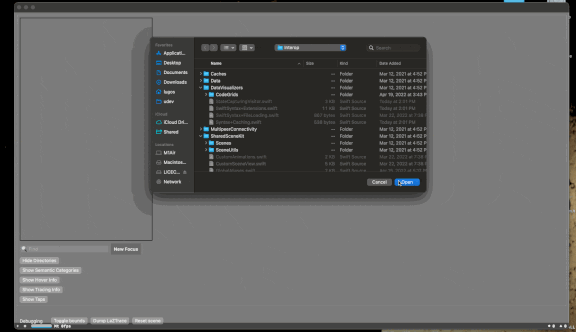
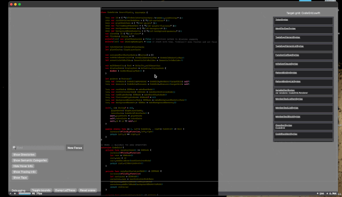
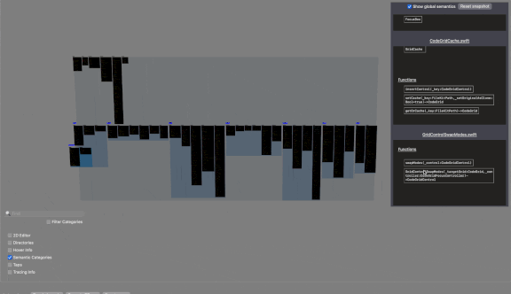
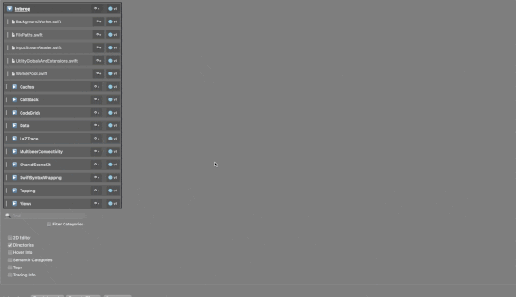
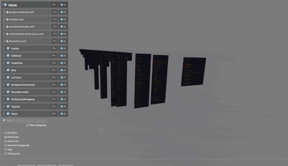
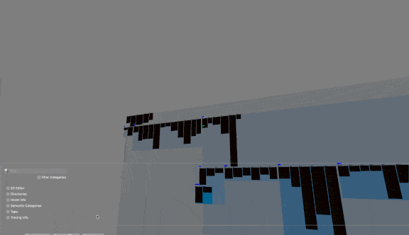
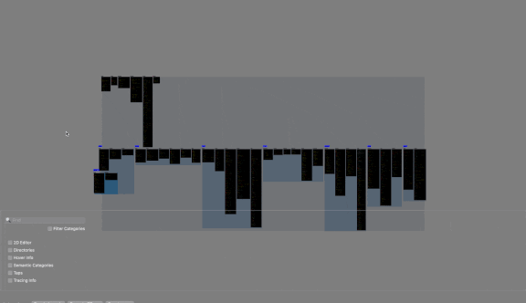

# AR/VR Code Visualizing
See Swift in Space

### What?

A tool to load up Swift files, render them into a SceneKit layer, and view the results in a 3D VR (macOS) or AR (iOS) environment.

# Some things you can do!
<table style="padding:10px">
  <tr>
    <td>Load directories</td>
    <td>Analyze syntax</td>
  </tr>

  <tr>
    <td>Query categories and type info</td>
    <td>.. globally, too!</td>
  </tr>

  <tr>
    <td>Group files</td>
    <td>Search reference names</td>
  </tr>

  <tr>
    <td>Trace app execution</td>
    <td>[WIP] Editing!</td>
  </tr>
  
  <tr>
    <td>
      Walk around your code in AR on iOS and iPad!</td>
  </tr>
</table>

### Why?

Plenty of reasons why. Here are some smarter people with better presentation skills and more carefully studied reasons:

- https://embodiedcode.net/
- https://divan.dev/posts/visual_programming_go/
- https://futureofcoding.org/
- https://stars.library.ucf.edu/etd/5511/ (<3 UCF)
- <your name here / link here>
  
### How?

Lots and lots of other people's tools and code suggestions. Primarily:

- SceneKit and a light AR wrapper for iOS support.
- [SwiftSyntax](https://github.com/apple/swift-syntax) for parsing Swift files and grabbing an Abstract Syntax Tree.
- [SwiftTrace](https://github.com/johnno1962/SwiftTrace) to capture execution traces and generate small tracing corpuses for visualization.
- [FileKit](https://github.com/nvzqz/FileKit) just because it's a nice abstraction.

### When?

Whenever I can, and even sooner if you help! All questions, contributors, ideas, thoughts, issues, suggestions, hopes, dreams, and pull requests are welcome!

## How to run it

You will need everything in this repository, including the syntax parsing libraries for SwiftSyntax targeting macOS, and iOS - play along with your phone or tablet!

The current goal is to allow you to:

- Pull the project
- Run it from XCode, targeting your iPhone or Mac laptop
- See code in space

At the moment, none of the important things with respect to building a functioning release binary are in place. Everything is experimental, unstable, and ready to explode at any moment. It's very exciting.

## How can I help?

Anything is fine, and if something might be project related, feel free to create an Issue. It's a boring but functional discussion place, and doesn't require bumping around to other chat platforms or external wikis. We can get there later if needed.

You can also free fring to ping me directly from my GitHub profile. And, if you can't seem to find a pingagle thing, make an issue and bug me about it! I want to make sure those with interest in working on this have an easy way to get a hold of me, and everyone else with a curious eye.

### What's next?

Likely to be out of date sooner rather than later, here's a running list of target features, fixes, and ideas being worked on now-ish!

* Editing: using a standard 2D editor to select and edit selected files in-line, rendering as necessary.
* Update GlyphNode to support smarter focusing; more geometry slots, better caching flow, etc.
* Tracing
** Multi-queue: currently traces one queue at a time. Trace each running queue simultaneously.
** Static lines: draw paths through an ordered set of trace lines to create 'static' visualization of call flow
* Update mobiles interfaces
** Most controls are supported on iPhone / iPad. Use interface.idiom to create different layouts per device
** iPhone - editor is modal, iPad - editor is resizable
* Update mainframe interfaces
** Add support to dock/popout panel windows (fun feature!)
* LSP integration
** Jump to definition to auto-render and jump to grid syntax nodes
** Server/client interaction from phone to mainframe (pretty much no way to get sourcekit-lsp running on device AFAIK)
* TapKit
** I bought this weird TapStrap thing for more inputs. It's kinda fun for shortcuts. Code is there play with.