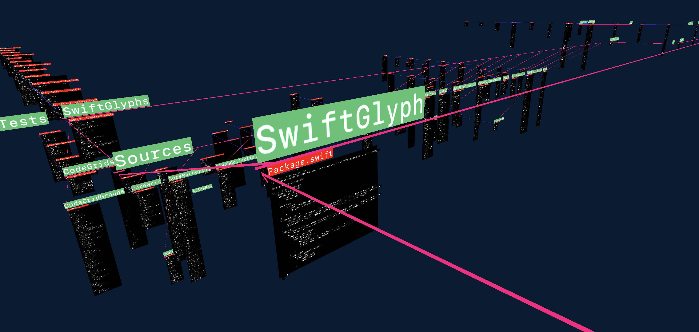

# SwiftGlyph HI/LO

## SwiftGlyph Alpha

If you're reading this, you're seeing the first major update of the iteration of LookAtThat - now happily modularized and imported for your enjoyment.

There are a number of major changes to the feature set, including the first batch of updated rendering techniques (this term applied extremely loosely).

[WIP] MetalLink and SwiftGlyph are the stars of the show.

https://www.github.com/tikimcfee/SwiftGlyph

https://www.github.com/tikimcfee/MetalLink

### What Works in the Alpha

- New GPU based UTF8->UTF32->Unicode (fauxnicode <3) parsing and text layout.
- Load up arbitrary directories of mostly code and render it all in 3D.
- Download and view GitHub repositories in app and view them like local data.
- Dual-style rendering for iOS / macOS for platform optimizations.
- AtlasTexture load / save / preload / reset for viewing and saving newly seen glyphs (currently limited to 1 Atlas sheet!)
- Mouse-based hover interactions, including symbol-highlighting (macOS includes AST node viewing)

The macOS target includes lots of random features in varying working states, including:

- Full text search with visual highlighting (scale / color / position)
- Syntax highlighting for Swift code using SwiftSyntax
  
### How to run it

This is the demonstration consuming app project for SwiftGlyph, which is the major wrapping library around MetalLink. You should be able to ... :

- Clone
- Open the `xcproject`
- (As needed) update the signing magicka within Xcode
- Choose your target (HI == macOS, LO == iOS), and device. It'll complain if you choose the wrong device / target pairing.  

## How can I help?

Anything is fine, and if something might be project related, feel free to create an Issue. It's a boring but functional discussion place, and doesn't require bumping around to other chat platforms or external wikis.

You can also free fring to ping me directly from my GitHub profile. And, if you can't seem to find a pingable thing, make an issue and bug me about it! I want to make sure those with interest in working on this have an easy way to get a hold of me, and everyone else with a curious eye.

## What's next?

### Editing
- 3D or 2D...

### Tracing
- SwiftTrace was once, and must be again.. or should it?

### UI
- The interface is full of buttons like the universe is full of stars.
- More correctly, it's full of buttons like LEO is full of metallic bodies.

### Language Server / Sourcekit
- This is the unlock for better, more generic syntax highlighting.
- SwiftSyntax is great, but limited.

## With thanks, reference, and deference to:

- https://embodiedcode.net/
- https://divan.dev/posts/visual_programming_go/
- https://futureofcoding.org/
- https://stars.library.ucf.edu/etd/5511/ (<3 UCF)
